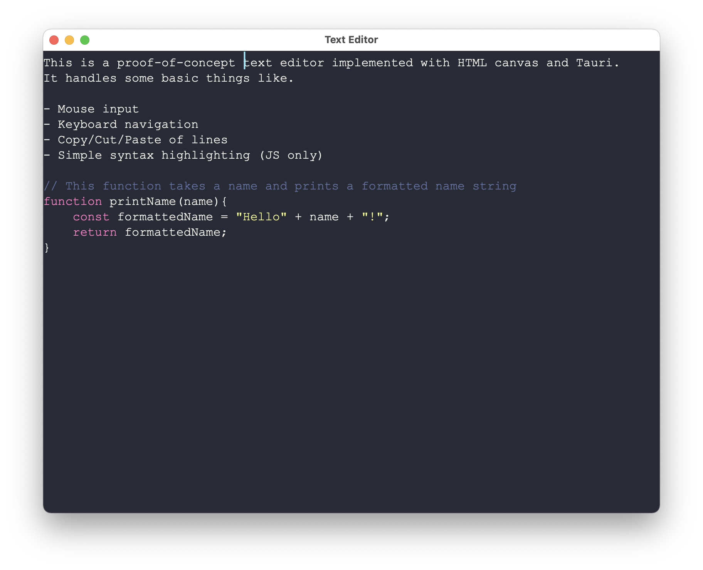

# Canvas Text Editor

A proof of concept text editor implemented using HTML canvas. Extremely rough, don't use for anything serious.

[Demo](https://cfu288.github.io/canvas-text-editor/)

Currently implemented:

- Mouse input handling
- Keyboard navigation
- Simple line buffer copy/cut/paste
- Simple syntax highlighting
- Open and read file with cmd+o
