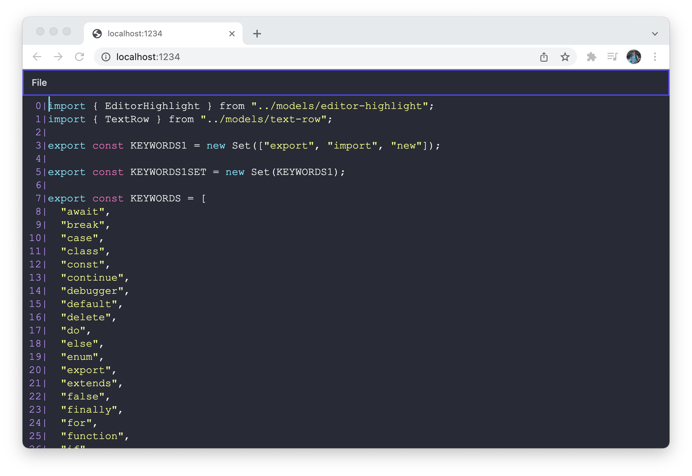

# Canvas Text Editor

A proof-of-concept text editor implemented using HTML canvas. This is an extremely rough prototype, don't use for anything serious as it is missing features like accessibility.

Inspired by [this article](https://viewsourcecode.org/snaptoken/kilo/)

[Demo](https://cfu288.github.io/canvas-text-editor/)



## Requirements

- npm

## Installation

`npm install` to install dependencies.
`npm start` to run a local development server.
`npm run build` to generate a production build.
`npm test` to run unit tests.

## Currently implemented:

- Mouse input handling
- Keyboard navigation
- Simple line buffer copy/cut/paste
- Simple syntax highlighting
- Line numbers
- Open and read file with cmd+o (Chrome Only)
- Save file (Chrome Only)
- Scroll up and down (cmd/ctrl + shift arrow up/down)

## Implementation details

Currently this editor uses an array of Gap Buffers to represent and manipulate the file data. I chose to prioritize speed of clustered insertions and deletions, which made the Gap Buffer a good fit. Internal benchmarks show it is more performant than a javascript simple array or another implementation of Gap Buffer using javascript Typed Arrays. See the benchmark at `./src/models/benchmark.ts` for more information.

You can run the benchmark using:

```bash
npm run benchmark
```

Benchmarks:

```bash
Starting Random Sequential Inserts of 500 chars benchmark:
Normal Gap Buffer is 9.4x faster than Type Array Based Gap Buffer
Normal Gap Buffer is 1.4e+2x faster than Array


Starting Sequential Iteration benchmark:
Array is 1.8x faster than Normal Gap Buffer
Array is 2.1x faster than Type Array Based Gap Buffer


Starting Random Deletions benchmark:
Type Array Based Gap Buffer is 1.2x faster than Normal Gap Buffer
Type Array Based Gap Buffer is 52x faster than Array


Starting Initialization of 100 objects benchmark:
Array is 2.5x faster than Normal Gap Buffer
Array is 45x faster than Type Array Based Gap Buffer
```

## License

[MIT](https://choosealicense.com/licenses/mit/)
